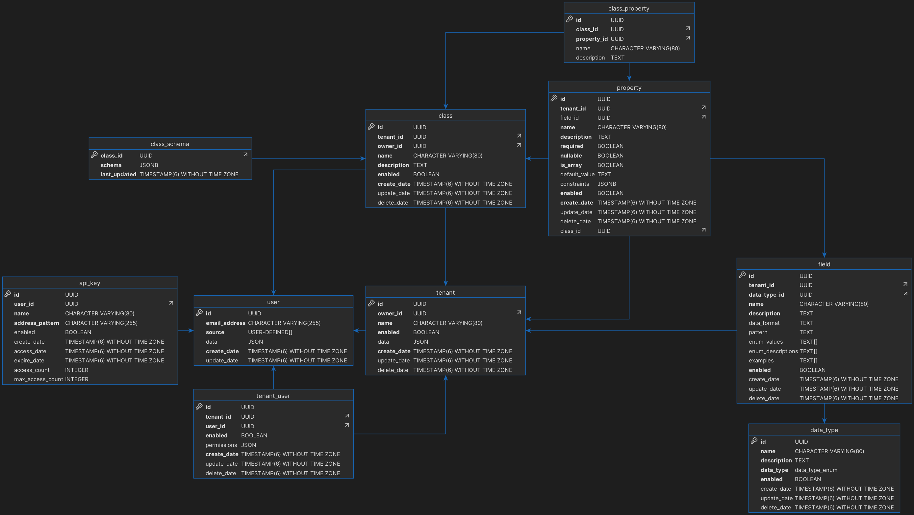

# objectified-db

Database Layer of Objectified

This project contains the database for Objectified.

## Prerequisites

This database schema is defined for Postgres.

You must install [`schema-evolution-manager`](https://github.com/mbryzek/schema-evolution-manager) 

## Running the script

In order to run the loading script, you must have the following environment variables
set:

- POSTGRES_USER
- POSTGRES_PASSWORD
- POSTGRES_HOST
- POSTGRES_PORT

All of these will be used to create a `postgresql://` URL for which the psql command
will use.

To run the script, simply run:

```shell
sh ./run.sh
```

This will build and execute the SQL commands to generate the schema.

> **NOTE:**\
> If you have already run this script once, and want to back up the data, make sure
> to use `pg_dump` command to dump your schema beforehand.  Otherwise, if you have loaded
> your database prior to this, the database will simply include an upgrade path from the
> point which you ran the install script.

## Current database visualized



## Schema: defined

[Refer to this document for an explanation of the schema](docs/schema.md).